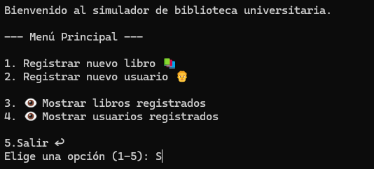
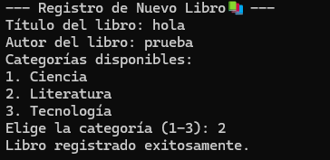
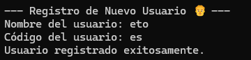
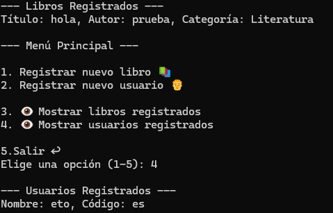

# 📚 Simulador de Biblioteca Universitaria

Este programa implementa un sistema sencillo para gestionar una biblioteca universitaria desde consola.  
Permite registrar libros, registrar usuarios, y mostrar la información registrada de forma interactiva.
| Requerimiento funcional | Cumplido (✓/X) |
| :---------------------- | :-------------- |
| Registro de nuevos libros |✓|
| Registro de nuevos usuarios |✓|
| Mínimo 3 categorías de libros |✓|
---

## 🚀 Funcionalidades

- **Registro de libros**: Permite ingresar título, autor y categoría (Ciencia, Literatura o Tecnología).
- **Registro de usuarios**: Cada usuario se identifica con un nombre y un código.
- **Visualización de libros**: Muestra los libros registrados en la biblioteca.
- **Visualización de usuarios**: Muestra los usuarios registrados en el sistema.
- **Menú interactivo**: El usuario puede navegar por las opciones hasta decidir salir.

---

## 🖼️ Capturas de funcionamiento

A continuación, se incluyen capturas de ejemplo del programa en ejecución.  
Las imágenes se encuentran en la carpeta `img` y tienen el formato `capturaX.jpg`.

- Menú principal  
  

- Registro de libro  
  

- Registro de usuario  
  

- Visualización de registros  
  

---

## 🏗️ Descripción de clases y métodos

### `class Libro`
Representa un libro en la biblioteca.
- **Atributos**:
  - `titulo` (str): título del libro.
  - `autor` (str): autor del libro.
  - `categoria` (str): categoría del libro.

### `class Usuario`
Representa un usuario de la biblioteca.
- **Atributos**:
  - `nombre` (str): nombre del usuario.
  - `codigo` (str): código único del usuario.

### `class Biblioteca`
Gestiona los registros de libros y usuarios.
- **Atributos**:
  - `libros` (list): lista de libros registrados.
  - `usuarios` (list): lista de usuarios registrados.
  - `categorias` (list): categorías disponibles (Ciencia, Literatura, Tecnología).

- **Métodos**:
  - `registrar_libro()`: solicita datos de un libro y lo almacena.
  - `registrar_usuario()`: solicita datos de un usuario y lo almacena.
  - `mostrar_libros()`: imprime los libros registrados.
  - `mostrar_usuarios()`: imprime los usuarios registrados.

### `main()`
Función principal que ejecuta el menú interactivo para que el usuario elija opciones.

---

## ⚙️ Justificación técnica del diseño

1. **Estructuras de datos simples (listas):**  
   Se eligieron listas para almacenar libros y usuarios, ya que el enfoque es educativo y de bajo volumen de datos.  
   En un sistema real, podrían reemplazarse por bases de datos.

2. **Menú interactivo por consola:**  
   Facilita el uso sin necesidad de interfaz gráfica, ideal para prácticas iniciales de POO y estructuras de control.

3. **Validaciones básicas:**  
   El programa incluye validaciones de categorías y opciones del menú, evitando errores comunes de entrada del usuario.

```bash
python main.py
